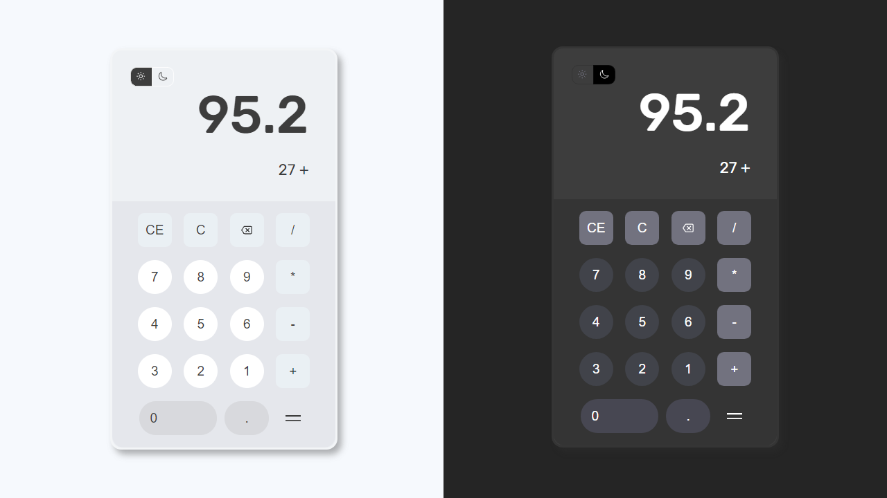

<h1 align="center"> Calculadora Web Simples </h1>

    

## 🚀 Tecnologias

Esse projeto foi desenvolvido com as seguintes tecnologias:

- HTML e CSS
- JavaScript
- Git e Github
- Figma

## 💻 Projeto

Calculadora web simples com funcionalidades aritméticas básicas, (somar, subtrair, dividir e multiplicar), além de outras funções como excluir do visor o último item digitado ou todos, e mudar o tema para light ou dark.

## 🔖 Observações

Usei de base e inspiração para o design da calculadora este projeto do figma: https://www.figma.com/community/file/1101501251422381707

---

### Desenvolvido por [@martinsvp](https://github.com/martinsvp) 👋

